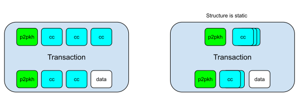

# PYCC

PYCC is a Python library for implementing Crypto-Conditions for the Komodo blockchain.

It's like a Django Web Framework for CC.

## Concepts

In PYCC you declare a `schema` for a CC contract, and you get a set of functions to create and validate transactions.

PYCC apps can be plugged into the Komodo blockchain by building komodo with blockchain support (link TODO).

### Schema

The Schema is where you declare the structure of your CC app. A schema contains CC apps, which define transactions.

See an example of a [faucet app defined as a PYCC schema](pycc/examples/faucet.py).

### Consume and Produce

The Schema then gives you two functions: `consume` to turn a `tx` into `params` (while also validating the structure),
and `produce` to to create a `tx` from `params`.

During the on-chain validation, the transaction is consumed in order to validate it's structure, and the business logic is performed on the resulting params rather than the TX itself.

```
                             Consume (also validates)

                           +-------------------------->


      +--------------------+                          +--------------------+
      |                    |                          |                    |
      |    Tx Binary       |                          |     Tx Params      |
      |                    |                          |                    |
      +--------------------+                          +--------------------+

                           <--------------------------+

                               Produce Tx from Params
```

### Tx deconstruction

PYCC conceptualizes transactions as function calls, that have many parameters and a tuple of outputs.

The number of inputs and outputs may vary, but the structure is static. When a variable number of inputs
is required, that is encoded as a list of inputs, so the structure does not change.



## Setup

Install rust: https://www.rust-lang.org/tools/install
```shell
rustup toolchain install nightly
```

#### build pycctx.so
```shell
cd ~/pycc
make pycctx
```

#### create a new virtual env 
```shell
virtualenv -p python3 .env
```

#### enter virtual env
```shell
source .env/bin/activate
```

#### install
```shell
pip3 install -r requirements.txt
```


#### add ~/pycc PATH 
```shell
export PYTHONPATH=:~/pycc
```

#### launch a new chain using https://github.com/alrighttt/komodo/tree/pycc with CONFIGURE_FLAGS="--enable-pycc"
```shell
./komodod -ac_name=PYCC -ac_supply=999999 -ac_nk=96,5 -ac_blocktime=10 -testnode=1 -ac_pycc=pycc.active -ac_cc=2
```

This chain will now redirect ALL CC validation to `~/pycc/pycc/active.py`. This `active.py` will define which pyCC modules are activated and route validation and pycli requests accordingly. 

To run tests:

```
pytest
```
